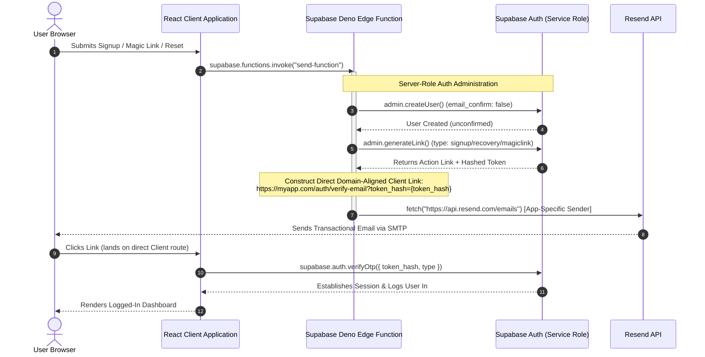

# Specification: Custom Transactional Emails via Resend & Supabase Edge Functions

This document defines the architecture and implementation standards for transactional email delivery in multi-app environments sharing a single, unified Supabase database project.

---

## 1. Context & Problem Statement

When multiple applications share a single Supabase backend:
1. **Global SMTP Limitation**: Supabase Auth only allows **one** global SMTP configuration. This restricts all outbound emails (signups, resets, magic links) to a single sender address (e.g., `support@app-a.com`) and display name, confusing users of `app-b.com`.
2. **Template Branding Collision**: Supabase only supports one design template per transaction type (e.g., a single "Confirm SignUp" email body). Apps cannot have separate, customized branding.
3. **Domain Alignment Checks**: Modern email delivery services like **Resend** flag emails if the link domains (e.g. `rdnaqrzqpcicskylmsyl.supabase.co`) mismatch the sender domain (e.g., `app-a.com`), sending transactional mail directly to spam folders.

---

## 2. Architectural Design: "Option B" (The Standard)

To solve these constraints, we bypass Supabase's built-in mailer completely and route all emails through app-specific **Resend** endpoints.



---

## 3. Standardized Edge Function Boilerplate

Every app must deploy Edge Functions for **Registration**, **Magic Links**, and **Password Resets**.

### A. The User Registration Function (`register-user`)
This function creates the user in the database without sending any automatic email, generates the token, constructs the link, and triggers Resend.

```typescript
// supabase/functions/[app]-register-user/index.ts
import { serve } from "https://deno.land/std@0.168.0/http/server.ts";
import { createClient } from "https://esm.sh/@supabase/supabase-js@2.39.0";

const corsHeaders = {
  "Access-Control-Allow-Origin": "*",
  "Access-Control-Allow-Headers": "authorization, x-client-info, apikey, content-type",
};

serve(async (req) => {
  if (req.method === "OPTIONS") return new Response("ok", { headers: corsHeaders });

  try {
    const supabaseUrl = Deno.env.get("SUPABASE_URL") ?? "";
    const supabaseServiceKey = Deno.env.get("SUPABASE_SERVICE_ROLE_KEY") ?? "";
    const resendApiKey = Deno.env.get("[APP_PREFIX]_RESEND_API_KEY") ?? Deno.env.get("RESEND_API_KEY") ?? "";

    const body = await req.json();
    const { email, password, name, redirectTo, isResend } = body;

    const supabaseAdmin = createClient(supabaseUrl, supabaseServiceKey, {
      auth: { autoRefreshToken: false, persistSession: false },
    });

    // CRITICAL: getUserByEmail is unsupported in supabase-js v2. List and search instead.
    const { data: listData, error: findError } = await supabaseAdmin.auth.admin.listUsers({
      page: 1, perPage: 1000
    });
    const existingUser = listData?.users?.find(u => u.email?.toLowerCase() === email.toLowerCase());

    let user;

    if (isResend) {
      if (!existingUser) return new Response(JSON.stringify({ error: "User not found" }), { status: 400, headers: corsHeaders });
      user = existingUser;
    } else {
      if (existingUser) {
        if (existingUser.email_confirmed_at) {
          return new Response(JSON.stringify({ error: "Email already registered" }), { status: 400, headers: corsHeaders });
        }
        // Update credentials for unconfirmed registration retries
        const { data: updated } = await supabaseAdmin.auth.admin.updateUserById(existingUser.id, { password, user_metadata: { display_name: name } });
        user = updated.user;
      } else {
        // Create user with email_confirm: false to prevent default Supabase emails
        const { data: created, error: createError } = await supabaseAdmin.auth.admin.createUser({
          email, password, email_confirm: false, user_metadata: { display_name: name }
        });
        if (createError) throw createError;
        user = created.user;
      }
    }

    // Generate secure token
    const { data: linkData } = await supabaseAdmin.auth.admin.generateLink({
      type: "signup", email, options: { redirectTo }
    });

    const hashedToken = linkData.properties.hashed_token;
    const clientOrigin = new URL(redirectTo).origin;
    const customActionLink = `${clientOrigin}/login?token_hash=${hashedToken}&type=signup`;

    // Send email using Resend API
    const resendResponse = await fetch("https://api.resend.com/emails", {
      method: "POST",
      headers: { "Authorization": `Bearer ${resendApiKey}`, "Content-Type": "application/json" },
      body: JSON.stringify({
        from: "My App <support@myapp.com>",
        to: [email],
        subject: "Confirm your Account",
        html: `<a href="${customActionLink}">Confirm Email</a>`
      }),
    });

    return new Response(JSON.stringify({ success: true }), { status: 200, headers: corsHeaders });
  } catch (err: any) {
    return new Response(JSON.stringify({ error: err.message }), { status: 500, headers: corsHeaders });
  }
});
```

---

## 4. Standardized Client-Side Verification Route

When the user clicks the direct link in the email, they land on a client-side component (e.g., `/login` or `/auth/verify-email`). 

### CRITICAL: React Strict Mode & Render Loop Ref Guard
React Router's `useSearchParams()` returns a new object reference on every re-render. If placed in a `useEffect` dependency array, updating state inside the effect (e.g. setting loading or error states) triggers an infinite loop. 
Because `verifyOtp` tokens are **single-use only**, the first loop consumes the token, and the second loop fails with a "token expired" error. 

**All clients must implement a `useRef` guard to guarantee the OTP token is verified exactly once:**

```typescript
import React, { useEffect, useRef, useState } from 'react';
import { useNavigate, useLocation } from 'react-router';
import { supabase } from '@/lib/supabase';

export function Login() {
  const navigate = useNavigate();
  const location = useLocation();
  const [loading, setLoading] = useState(false);
  const [error, setError] = useState('');

  // 1. Declare the verification guard ref
  const verificationAttempted = useRef(false);

  useEffect(() => {
    const queryParams = new URLSearchParams(location.search);
    const tokenHash = queryParams.get('token_hash');
    const tokenType = queryParams.get('type') || 'signup';

    // 2. Enforce execution only once using the ref
    if (tokenHash && !verificationAttempted.current) {
      verificationAttempted.current = true;
      setLoading(true);

      supabase.auth.verifyOtp({
        token_hash: tokenHash,
        type: tokenType as any, // 'signup', 'magiclink', or 'recovery'
      })
      .then(({ error: verifyError }) => {
        if (verifyError) {
          setError(verifyError.message);
        } else {
          // Success: Session is established on the client domain
          navigate('/dashboard');
        }
      })
      .finally(() => setLoading(false));
    }
  }, [location.search, navigate]);

  return (
    <div>{loading ? "Verifying..." : error ? `Error: ${error}` : "Verify your account"}</div>
  );
}
```

---

## 5. Summary Checklist for Bootstrapping New Apps

To initialize a new application under this email architecture:

1. **Supabase Dashboard**: Keep **Confirm email** turned **ON** under Authentication Providers (this keeps users in unconfirmed state on registration until `verifyOtp` succeeds). Do NOT configure SMTP settings.
2. **Deno Edge Functions**: Clone `vd-register-user`, `vd-send-magic-link`, and `vd-send-password-reset` into a new folder named after your new app prefix (e.g. `appc-register-user`).
3. **Resend Configurations**: Verify the new domain (e.g., `myappc.com`) in your Resend portal. Set up standard DNS records (SPF, DKIM, DMARC) to guarantee 100% email delivery.
4. **Environment Variables**: Add your Resend API Key to the Supabase environment:
   ```bash
   supabase secrets set APPC_RESEND_API_KEY=re_...
   ```
5. **App Adapter**: Use `supabase.functions.invoke()` for registration, magic links, and password resets instead of calling `supabase.auth` directly.
6. **Frontend Route**: Implement the `useRef` guarded `verifyOtp` code inside the page component mapped to the redirect route.
